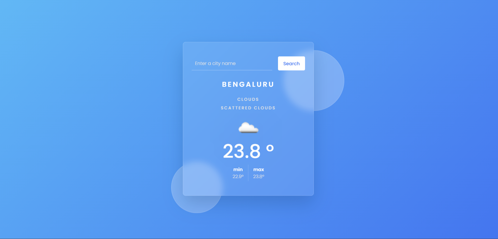

# RadarMe - Check the Weather

<h2>Overview</h2>
This web-based application allows users to check the weather of a specific location using the OpenAPI. It provides real-time weather data for any place you're interested in.

<h2>Features</h2>
Location-Based Weather: Enter the name of the place you want to check the weather for, and the application will fetch and display the current weather conditions.

Accurate Data: The application uses the OpenAPI to ensure that you receive up-to-date and reliable weather information.

User-Friendly Interface: The interface is designed to be intuitive and easy to use. You don't need to be a weather expert to get the information you need.

<h2>How to Use</h2>
Input Location: On the application's homepage, you'll find a text field. Enter the name of the place you want to check the weather for (e.g., "New York City" or "Paris").

Get Weather: Click the "Get Weather" button, and the application will retrieve the latest weather data for the specified location.

View Weather: The weather details will be displayed on the screen, including temperature, humidity, wind speed, and conditions (e.g., sunny, rainy, cloudy).

<h2>Technologies Used</h2>
HTML: The application's front-end is built using HTML for structure and layout.

CSS: CSS is used for styling the user interface, making it visually appealing.

JavaScript: JavaScript handles the interaction with the OpenAPI and the dynamic updating of weather information.

<h2>Installation<h2>
Clone the repository to your local machine using the following command:

<b>bash
Copy code
git clone <repository-url> </b>
Open the <b>index.html</b> file in your web browser to start using the application.

API Key
To ensure that the application can access the OpenAPI, you may need to obtain an API key from OpenAPI's website. Once you have the API key, insert it into the appropriate field in the application's code.

<h3>Credits</h3>
This application was created by Naman Agrahari. If you have any questions or feedback, please feel free to contact me at @nagrahari31@gmail.com.

